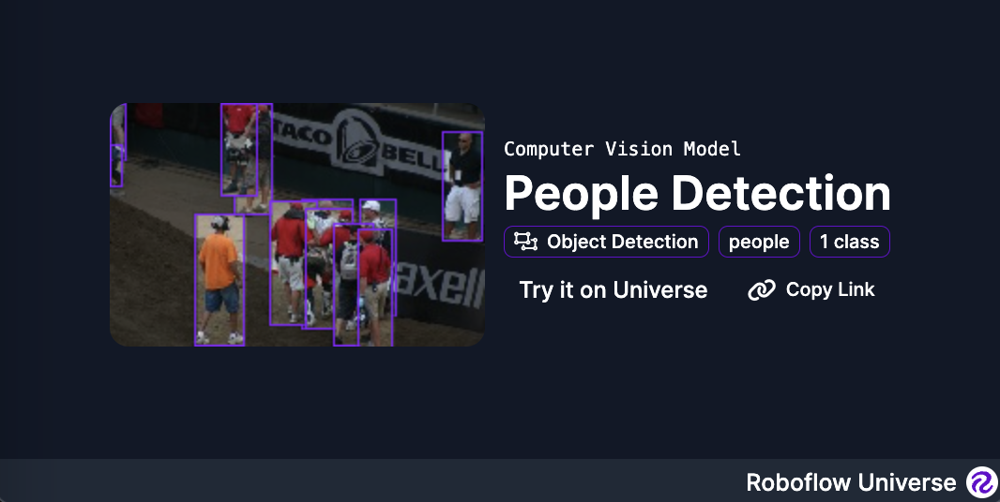

# Roboflow Universe Widget

The Roboflow Universe widget lets you embed links to your Roboflow models in your own website.

## How to Use

The Roboflow Universe widget is an `iframe` you can add to web pages.

To use the widget add the following HTML snippet to your website:

```html
<iframe src="https://embed.roboflow.com/{project_id}/{model_version}" width="100%" height="100%"></iframe>
```

Apply styles where necessary so the widget fits on your web page.

## License

This project is licensed under an [MIT license](LICENSE).